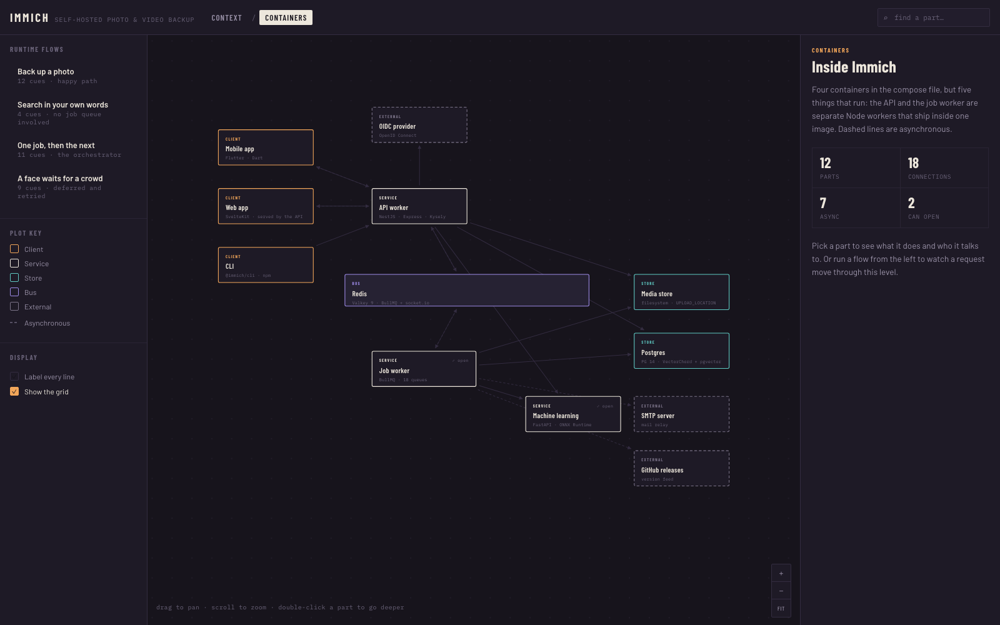
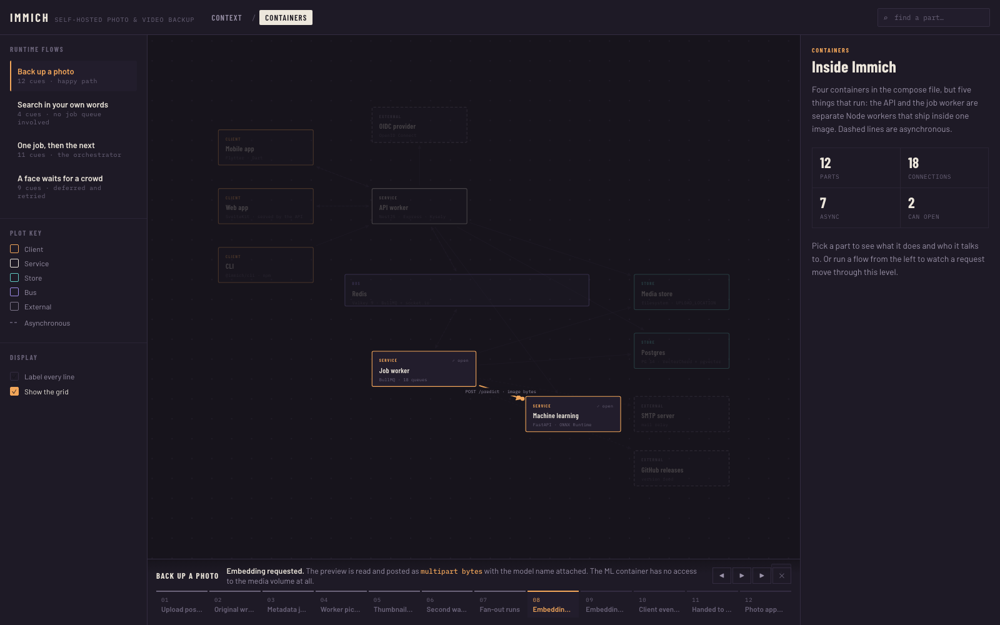
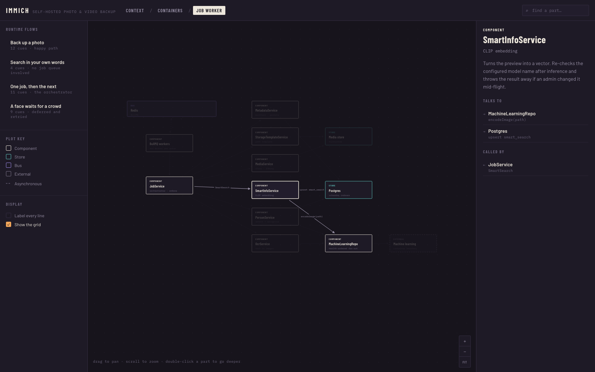

# draw-c4

A [Claude Code](https://code.claude.com) skill that turns a codebase into an **interactive, C4-style
architecture diagram** — a single HTML file, no build step, opens in any browser.



The output has:

- **C4-style drill-down levels** — context → containers → components, up to four levels of detail
- **Pan & zoom** across the canvas
- **An inspector** for nodes and edges
- **A step-through player** that animates runtime flows (how a request moves through the system)

Everything lives in one HTML file you can open in any browser, commit, or share.

---

## Example

**[Immich, diagrammed](https://shibainu0817.github.io/draw-c4-skill/examples/immich/architecture.html)** — open it
and click into a box.

[Immich](https://github.com/immich-app/immich) is a self-hosted photo and video server: a NestJS API, a
Python inference service, Postgres carrying two vector indexes, and eighteen job queues. The diagram has
four levels and four runtime flows — among them the upload path from a phone through the queue to a
searchable embedding, and the face-clustering job that defers itself when it cannot yet find a crowd to
match against.

The files sit in [`examples/immich/`](examples/immich/): open
[`architecture.html`](examples/immich/architecture.html), or read
[`model.json`](examples/immich/model.json) to see what the skill actually wrote.

Picking a flow replays it one hop at a time — the rest of the diagram dims, the active edge lights up,
and the note carries the specifics from the code:



Double-clicking a container opens its insides, and the inspector lists what each part talks to:



It was built by reading the source rather than the docs, which is why it disagrees with Immich's own
architecture page in three places — the `immich-microservices` container no longer exists, there is no
separate web container, and Redis is doing double duty as both the job queue and the websocket
backplane.

<sub>Unofficial, and not affiliated with or endorsed by the Immich project. Describes commit
[`9ab12b0`](https://github.com/immich-app/immich/commit/9ab12b0c4e9394160708ba117e1b377039a69439)
(2026-08-17) and will drift as the code moves. Immich is AGPL-3.0; no Immich source is reproduced here.</sub>

---

## Install

```bash
npx skills@latest add ShibaInu0817/draw-c4-skill -g
```

<details>
<summary>Other ways to install</summary>

**As a Claude Code plugin** — updates arrive automatically when a new version ships. The command is
`/draw-c4:draw-c4`.

```
/plugin marketplace add ShibaInu0817/draw-c4-skill
/plugin install draw-c4@draw-c4-skill
```

**By hand** — copy the folder into your skills directory.

```bash
cp -R skills/draw-c4 ~/.claude/skills/                        # every project
cp -R skills/draw-c4 /path/to/your/project/.claude/skills/    # just this one
```

</details>

## Use

Ask for a diagram in whatever words come naturally:

> diagram this codebase
>
> how does a request flow through this?
>
> the architecture changed — refresh the diagram

Or invoke it directly with `/draw-c4`.

You get `architecture.html` — open it in a browser — and `model.json` beside it. Keep the JSON: it is
the source the next update starts from.

---

## What it does not do

Claude reads your code and writes the model; `plot.py` only validates and renders it. `check` will catch
a dangling reference or two boxes sitting on top of each other. It cannot catch a wrong claim.

The skill is written to refuse guesses — every box is meant to trace back to a file, a config entry or a
route handler, and anything genuinely unclear should be left out rather than invented. That is an
instruction, not a guarantee. Read a new diagram before you rely on it, and treat anything surprising as
something to check rather than something you just learned.

---

## Requirements

- **Python 3** — standard library only (`argparse`, `json`, `os`, `re`, `sys`). No `pip install` needed.

---

## How it works

You do not need any of this to use the skill — Claude drives it for you. It matters if you want to
edit a diagram by hand or contribute.

The diagram is two things welded into one HTML file:

- **The renderer** — [`skills/draw-c4/assets/plot-template.html`](skills/draw-c4/assets/plot-template.html),
  fixed HTML/CSS/JS that handles layout, hit-testing, the inspector, and the flow player.
- **The model** — one JSON object describing the system (levels, nodes, edges, flows). This is the only
  thing that varies between diagrams.

[`skills/draw-c4/scripts/plot.py`](skills/draw-c4/scripts/plot.py) moves the model in and out of the HTML,
so an existing diagram can be read back, edited as data, and rebuilt:

From a clone of this repo:

```bash
cd skills/draw-c4

# build a new diagram from a model
python3 scripts/plot.py layout model.json --all      # auto-place nodes
python3 scripts/plot.py check  model.json            # validate the model
python3 scripts/plot.py build  model.json architecture.html

# update an existing diagram
python3 scripts/plot.py extract architecture.html model.json   # recover the model
# ...edit model.json...
python3 scripts/plot.py layout model.json            # keep coords, park new nodes
python3 scripts/plot.py check  model.json
python3 scripts/plot.py build  model.json architecture.html
```

Installed rather than cloned, the scripts live in your skills directory — point `python3` at the
absolute path instead of `cd`-ing.

- [`skills/draw-c4/references/model-schema.md`](skills/draw-c4/references/model-schema.md) documents every
  model field.
- [`skills/draw-c4/assets/example-model.json`](skills/draw-c4/assets/example-model.json) is a complete,
  hand-tuned example to imitate.

Full authoring guidance lives in the skill itself:
[`skills/draw-c4/SKILL.md`](skills/draw-c4/SKILL.md).

---

## License

[MIT](LICENSE).
